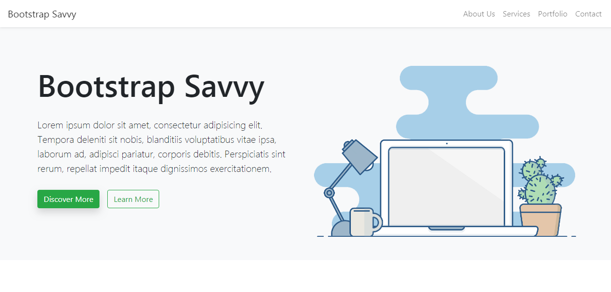

# Bootstrap Savvy

A simple one page bootstrap 4 website template.

### screenshot

### Credits:

Css framework

[Bootstrap 4](https://getbootstrap.com/)

Icons

[linearicons](https://linearicons.com/)

Smooth scrolling

[smooth scrolling code](https://css-tricks.com/snippets/jquery/smooth-scrolling/)

### Designed and Developed by

[Abubakar Oyerogba](https://abusavvy.github.io/)

### To Do

Upgrade to bootstrap 5 version
